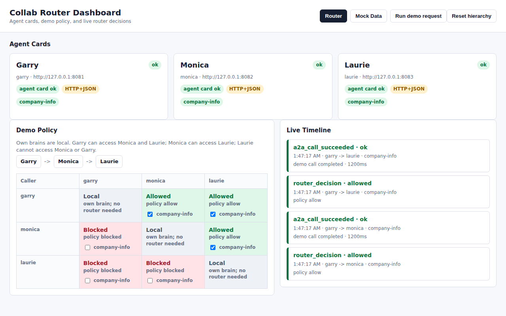
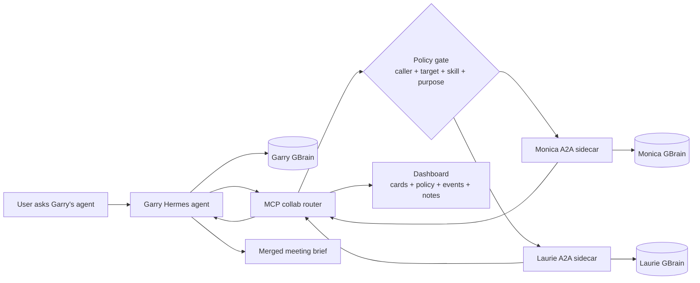

# collab-brain

**Agents with their own brains, working together.**

Your AI should be able to ask your teammate's AI without merging everyone's
private notes into one shared dump.

GBrain captures more than facts. It captures your taste: the meetings you took,
the people you trust, the risks you noticed, the follow-ups you care about. An
agent is the encapsulation over that brain: the interface that can reason,
answer, and act from your lived context. `collab-brain` makes those agents
multiplayer.

Built for the [YC GStack x GBrain hackathon](https://events.ycombinator.com/GStack).
The host install path follows the upstream
[GBrain standalone CLI docs](https://github.com/garrytan/gbrain) and the
[GStack + GBrain guide](https://github.com/garrytan/gstack/blob/main/USING_GBRAIN_WITH_GSTACK.md).



## The Demo Payoff

Garry is meeting Maya, founder of Acme, in 30 minutes.

Garry's own brain only has one sparse bridge-round email. Monica's brain has
GTM and pipeline context. Laurie's brain has product, CTO, and HIPAA context.
No single brain has the full picture. `collab-brain` asks the allowed peer
brains and returns one meeting-ready brief.

What only the merge surfaces:

- Maya says 4 design partners are closing, but Nina privately told Monica that
  2 of the 4 are stalled in procurement.
- Maya treats HIPAA as handled, but David separately told Laurie he is still
  scoping months of compliance work.
- Maya undersells David, even though Laurie's technical read is that David is
  the real systems asset.

That is the product: distributed memory becomes useful at the moment of work.

Why not one shared brain? Because policy, consent, and taste live at the person,
not the database.

## Why This Is GBrain-Native

GBrain is not just a vector store in this repo. It is the durable memory layer
inside each agent.

- Each partner has an isolated local GBrain at `/root/.gbrain`.
- Markdown notes are imported into each partner brain independently.
- The router never gives one agent raw access to every brain. It asks a narrow
  `company-info` skill on allowed peer agents.
- The dashboard shows the policy, agent cards, mock source notes, and routing
  events so the demo is inspectable rather than magic.

The same pattern works outside Docker: install GBrain locally, import your own
notes, run one agent per person or role, and connect them through the router.

## Router As Trust Layer

The router is where multiplayer memory becomes safe enough for real teams.

Today it enforces caller, target, skill, and required `purpose` before one agent
can ask another agent's brain. The intended production path is to make this the
policy and protection layer for:

- PII redaction before context crosses agent boundaries
- prompt-injection filtering on retrieved notes and peer responses
- scoped skills so agents return narrow answers instead of raw memory dumps
- audit logs for who asked what, why, and whether policy allowed it
- per-person consent because every brain represents a real person's context and
  judgment

## AI Multiplayer Mode

The next step is running this for a small org.

In multiplayer mode, every teammate keeps their own agent and brain, while the
org shares skills, policy, and collaboration routes:

- **Personal brains stay personal.** Each teammate has a local GBrain with their
  notes, calls, meetings, docs, and working memory.
- **Shared skills are installed everywhere.** The org keeps reusable skills in a
  shared repo or profile bundle, for example `company-info`, `customer-context`,
  `hiring-context`, `deal-review`, and `follow-up-draft`.
- **Agents ask by capability, not by database access.** A teammate's agent asks
  another teammate's agent for a narrow skill result with a stated purpose.
- **Policy makes collaboration explicit.** The router controls who can ask whom
  and which skills are allowed.
- **The answer is multiplayer.** One agent can merge context from sales,
  product, support, recruiting, and leadership brains without flattening every
  private note into one shared memory dump.

For a concrete rollout plan, see
[`docs/small-org-ai-multiplayer.md`](docs/small-org-ai-multiplayer.md).

## Architecture



Default Compose services:

| Service | Purpose | Host access |
|---|---|---|
| `hermes-garry` | Garry agent + Garry GBrain + A2A sidecar | `localhost:8081` |
| `hermes-monica` | Monica agent + Monica GBrain + A2A sidecar | `localhost:8082` |
| `hermes-laurie` | Laurie agent + Laurie GBrain + A2A sidecar | `localhost:8083` |
| `collab-router-garry` | MCP router for Garry's allowed peer requests | internal |
| `collab-router-monica` | MCP router for Monica's allowed peer requests | internal |
| `collab-router-laurie` | MCP router for Laurie's allowed peer requests | internal |
| `collab-dashboard` | Demo observability and policy UI | `localhost:8095` |

The built-in demo policy is:

- everyone can use their own brain locally
- Garry can ask Monica and Laurie
- Monica can ask Laurie, but not Garry
- Laurie cannot ask Monica or Garry

## Quick Docker Demo

Docker is the fastest way to run the complete demo exactly as judges should see
it. First build can take several minutes because the image installs Hermes and
GBrain. You also need a model provider key for the live peer-agent summaries.
It is not the only install path; see [Install On Your Machine](#install-on-your-machine).

Copy the env template:

```bash
cp setup/docker/env/hermes.env.example setup/docker/env/hermes.env
```

Add at least one model provider key to `setup/docker/env/hermes.env`. The
default profile is configured for OpenRouter Kimi K2.6:

```env
OPENROUTER_API_KEY=...
HERMES_DEFAULT_PROVIDER=openrouter
HERMES_DEFAULT_MODEL=moonshotai/kimi-k2.6
```

Start the stack:

```bash
docker compose -f setup/docker/docker-compose.yml up -d --build
```

Open the dashboard and click **Run demo request**:

```text
http://localhost:8095
```

Check the sidecars and dashboard:

```bash
curl -s http://localhost:8081/healthz
curl -s http://localhost:8082/healthz
curl -s http://localhost:8083/healthz
curl -s http://localhost:8095/healthz
```

Show that each brain is isolated:

```bash
docker compose -f setup/docker/docker-compose.yml exec hermes-garry gbrain search "Acme"
docker compose -f setup/docker/docker-compose.yml exec hermes-monica gbrain search "Acme"
docker compose -f setup/docker/docker-compose.yml exec hermes-laurie gbrain search "Acme"
```

The dashboard button calls `POST /admin/demo-request`, which generates a visible
Garry -> Monica/Laurie routing event without needing to paste JSON-RPC on stage.

For the real MCP call, ask Garry's router to consult Monica and Laurie:

```bash
docker compose -f setup/docker/docker-compose.yml exec collab-router-garry sh -lc 'python3 - <<'"'"'PY'"'"'
import json, os, urllib.request

body = {
    "jsonrpc": "2.0",
    "id": 1,
    "method": "tools/call",
    "params": {
        "name": "ask_partner_brains",
        "arguments": {
            "partners": ["monica", "laurie"],
            "company_query": "Acme",
            "purpose": "Garry is preparing for a meeting with Maya from Acme",
        },
    },
}
headers = {"Content-Type": "application/json"}
token = os.environ.get("COLLAB_ROUTER_GARRY_MCP_TOKEN") or os.environ.get("COLLAB_ROUTER_MCP_TOKEN")
if token:
    headers["Authorization"] = "Bearer " + token
req = urllib.request.Request(
    "http://localhost:8090/mcp",
    data=json.dumps(body).encode(),
    headers=headers,
    method="POST",
)
print(urllib.request.urlopen(req, timeout=220).read().decode())
PY'
```

Use a narrow `company_query` such as `Acme`. Put meeting context in `purpose`.
This keeps GBrain retrieval focused while still giving the peer agent enough
intent to answer usefully.

## What To Look For

In the router response:

- Monica should surface GTM, ICP, pricing, and the design-partner pipeline gap.
- Laurie should surface product depth, David's technical role, and HIPAA scope.
- Garry can now prepare for the meeting with facts his own brain did not have.

See [`docs/sample-router-output.md`](docs/sample-router-output.md) for a
trimmed example of the expected merged payoff.

In the dashboard:

- **Agent Cards** show each A2A sidecar and its `company-info` skill.
- **Access Matrix** shows which peer brain calls are allowed or blocked.
- **Timeline** records router decisions and successful calls.
- **Mock Data** shows the committed markdown that seeded each GBrain.

The **Run demo request** button generates synthetic dashboard events without
running the live MCP request. The same action is available through curl:

```bash
curl -s -X POST http://localhost:8095/admin/demo-request \
  -H 'Content-Type: application/json' \
  -d '{"caller":"garry","targets":["monica","laurie"]}'
```

## What Is Real And What Is Synthetic

Real:

- separate persistent GBrain stores per partner container
- synthetic markdown imported into GBrain, not hardcoded into the router
- A2A-shaped sidecars that query local GBrain and ask Hermes to summarize from
  retrieved notes
- MCP router tools with caller/target/skill/purpose policy
- dashboard for agent cards, policy, routing events, and source-note inspection
- Garry-only `/collab` operator command MVP for toggling company brain access in
  Telegram

Synthetic:

- Acme, Maya, David, Nina, Monica, and Laurie are public demo constructs
- the dashboard `Run demo request` button creates synthetic timeline events for
  stage clarity
- production PII redaction and prompt-injection filtering are roadmap items for
  the router trust layer, not claims about the current local demo

## Install On Your Machine

The Docker setup proves the full system quickly. For a real machine install,
use the same parts directly: Hermes Agent, GBrain, markdown notes, and the
router.

Install GBrain using the official standalone CLI path:

```bash
git clone https://github.com/garrytan/gbrain.git
cd gbrain
bun install
bun link
gbrain init
```

Do not use `npm install -g gbrain`, `bun add -g gbrain`, or
`bun install -g github:garrytan/gbrain`. The upstream GBrain README documents
that those install the wrong package or skip required setup. Use `git clone`,
`bun install`, and `bun link`.

Create separate local demo brains:

```bash
mkdir -p brains/garry brains/monica brains/laurie

GBRAIN_HOME="$PWD/brains/garry" gbrain init
GBRAIN_HOME="$PWD/brains/garry" gbrain import "$PWD/setup/mockdata/garry" --no-embed

GBRAIN_HOME="$PWD/brains/monica" gbrain init
GBRAIN_HOME="$PWD/brains/monica" gbrain import "$PWD/setup/mockdata/monica" --no-embed

GBRAIN_HOME="$PWD/brains/laurie" gbrain init
GBRAIN_HOME="$PWD/brains/laurie" gbrain import "$PWD/setup/mockdata/laurie" --no-embed
```

Search them directly:

```bash
GBRAIN_HOME="$PWD/brains/garry" gbrain search "Acme"
GBRAIN_HOME="$PWD/brains/monica" gbrain search "Acme"
GBRAIN_HOME="$PWD/brains/laurie" gbrain search "Acme"
```

Replace `setup/mockdata/*` with your own markdown notes for real use. GBrain
treats `GBRAIN_HOME` as the parent directory and stores the brain under
`$GBRAIN_HOME/.gbrain`, so each user, team, or role can keep an isolated brain.

## Files That Matter

- `src/a2a_server.py` exposes a small A2A-shaped `company-info` endpoint backed
  by the local partner GBrain.
- `src/collab_router.py` exposes MCP tools that enforce caller/target policy
  before asking peer A2A sidecars.
- `src/dashboard_server.py` serves the dashboard for agent cards, policy,
  events, and source mock notes.
- `setup/mockdata/` contains the synthetic Acme corpus used to seed the demo.
- `setup/docker/` contains the reproducible multi-agent Docker environment.
- `docs/gbrain-acme-demo-workflow.md` contains the full demo script and expected
  merged answer.
- `docs/hackathon-submission.md` is the short submission brief.

## Useful Operations

Open a shell in a partner container:

```bash
docker compose -f setup/docker/docker-compose.yml exec hermes-garry bash
docker compose -f setup/docker/docker-compose.yml exec hermes-monica bash
docker compose -f setup/docker/docker-compose.yml exec hermes-laurie bash
```

Check installed tools inside a container:

```bash
docker compose -f setup/docker/docker-compose.yml exec hermes-garry hermes doctor
docker compose -f setup/docker/docker-compose.yml exec hermes-garry gbrain --version
docker compose -f setup/docker/docker-compose.yml exec hermes-garry gbrain doctor --json
```

Inspect or change demo policy:

```bash
curl -s http://localhost:8095/admin/state
curl -s -X PATCH http://localhost:8095/admin/access \
  -H 'Content-Type: application/json' \
  -d '{"caller":"garry","target":"monica","skill":"company-info","enabled":false}'
curl -s -X POST http://localhost:8095/admin/policy/reset
```

Inspect committed mock markdown through the dashboard API:

```bash
curl -s http://localhost:8095/admin/mock-data
curl -s 'http://localhost:8095/admin/mock-data/file?partner=garry&path=companies/acme.md'
```

Run Hermes interactively:

```bash
docker compose -f setup/docker/docker-compose.yml exec hermes-garry hermes
```

## Safety And Boundaries

This repo uses synthetic public fixture data. Acme, Maya, David, Nina, Monica,
and Laurie are demo constructs. Do not treat the mock profiles or notes as
private partner knowledge.

The default A2A sidecars are local-demo endpoints. They have no TLS and are
bound to localhost through Compose host port mappings. Do not publish them to a
network you do not control.

Put secrets in `setup/docker/env/hermes.env`. Do not commit real profile files
or API keys.

## Verify

Run the repo checks:

```bash
python3 -m unittest discover -s tests -v
python3 -m py_compile src/a2a_server.py src/collab_router.py src/dashboard_server.py
docker compose -f setup/docker/docker-compose.yml config --quiet
```

Stop the Docker demo:

```bash
docker compose -f setup/docker/docker-compose.yml down
```
