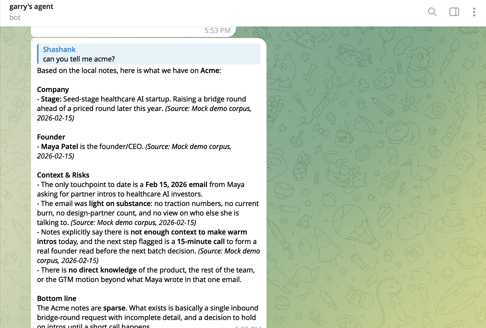
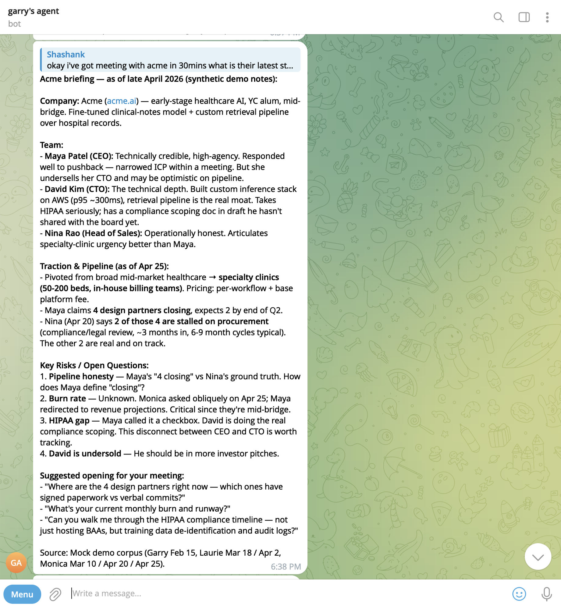

# GBrain Acme Demo Workflow

## Judge Demo

Garry is meeting **Maya**, founder of **Acme**, in 30 minutes.

GBrain checks Garry, Monica, and Laurie's brains, merges their notes, and gives Garry one briefing.

This is the shortest path to show the product:

1. Open the dashboard at `http://localhost:8095`.
2. Click **Run demo request** to show Garry -> Monica/Laurie policy-gated routing.
3. Show each partner has a different isolated GBrain result for `Acme`.
4. Run the live MCP request if the audience wants to inspect the real call.
5. Point at the answer: the merged brief contains facts Garry did not have.

## Prompt To Demo

```text
I am meeting Maya from Acme in 30 minutes.
What does YC know from Garry, Monica, and Laurie's brains?
Merge the context and give me the meeting plan.
```

## Demo Setup

- **Garry's brain** (Garry Tan, YC President): has one sparse bridge-round email from Maya; knows Acme is early, healthcare AI, and light on details.
- **Monica's brain** (Monica Hall, YC partner — GTM lens): met Maya and Nina; has sales, ICP, buyer urgency, and design-partner pipeline context.
- **Laurie's brain** (Laurie Bream, YC partner — product/technical lens): met Maya and David; has product, technical architecture, HIPAA, and compliance context.

Monica and Laurie are character names borrowed from HBO's *Silicon Valley*, used here as obviously-fictional YC partners.

Mock data lives in `setup/mockdata/`. Each folder is a separate importable GBrain corpus:

```bash
mkdir -p brains/garry brains/monica brains/laurie

GBRAIN_HOME="$PWD/brains/garry" gbrain init
GBRAIN_HOME="$PWD/brains/garry" gbrain import "$PWD/setup/mockdata/garry" --no-embed

GBRAIN_HOME="$PWD/brains/monica" gbrain init
GBRAIN_HOME="$PWD/brains/monica" gbrain import "$PWD/setup/mockdata/monica" --no-embed

GBRAIN_HOME="$PWD/brains/laurie" gbrain init
GBRAIN_HOME="$PWD/brains/laurie" gbrain import "$PWD/setup/mockdata/laurie" --no-embed
```

Mock Acme team:

- **Maya**: founder / CEO
- **David**: CTO
- **Nina**: Head of Sales

## Story Beat

1. Ask Garry's brain first: "I barely know Acme."
2. Ask Monica's brain: GTM improved, but the pipeline has a hidden issue.
3. Ask Laurie's brain: product is real, but HIPAA and the team narrative have hidden issues.
4. Ask GBrain to merge all three into one Acme briefing.

The before/after is the demo:

```text
Before: three partial memories.
After: one diligence-ready meeting brief.
```

Before — Garry's brain alone, asked `can you tell me acme?`:



After — same operator, 30 minutes before the meeting, after the router merges
Monica's and Laurie's brains:



## Runnable Docker Demo

The current Compose stack runs the core demo:

```bash
cp setup/docker/env/hermes.env.example setup/docker/env/hermes.env
```

Add a model provider key to `setup/docker/env/hermes.env`, then start:

```bash
docker compose -f setup/docker/docker-compose.yml up -d --build
```

Open:

```text
http://localhost:8095
```

Click **Run demo request**. This creates visible dashboard timeline events for
the Garry -> Monica/Laurie collaboration path without pasting JSON-RPC on stage.

Health checks:

```bash
curl -s http://localhost:8081/healthz
curl -s http://localhost:8082/healthz
curl -s http://localhost:8083/healthz
curl -s http://localhost:8095/healthz
```

Show isolated local brains first:

```bash
docker compose -f setup/docker/docker-compose.yml exec hermes-garry gbrain search Acme
docker compose -f setup/docker/docker-compose.yml exec hermes-monica gbrain search Acme
docker compose -f setup/docker/docker-compose.yml exec hermes-laurie gbrain search Acme
```

Then, for the real MCP call, show the live collab-router request from Garry to
Monica and Laurie:

```bash
docker compose -f setup/docker/docker-compose.yml exec collab-router-garry sh -lc 'python3 - <<'"'"'PY'"'"'
import json, os, urllib.request

body = {
    "jsonrpc": "2.0",
    "id": 1,
    "method": "tools/call",
    "params": {
        "name": "ask_partner_brains",
        "arguments": {
            "partners": ["monica", "laurie"],
            "company_query": "Acme",
            "purpose": "Garry is preparing for a meeting with Maya from Acme",
        },
    },
}
headers = {"Content-Type": "application/json"}
token = os.environ.get("COLLAB_ROUTER_GARRY_MCP_TOKEN") or os.environ.get("COLLAB_ROUTER_MCP_TOKEN")
if token:
    headers["Authorization"] = "Bearer " + token
req = urllib.request.Request(
    "http://localhost:8090/mcp",
    data=json.dumps(body).encode(),
    headers=headers,
    method="POST",
)
print(urllib.request.urlopen(req, timeout=220).read().decode())
PY'
```

Keep `company_query` narrow, for example `Acme`. Put meeting context in
`purpose`. Broader query strings such as `Acme Maya meeting prep` can miss
GBrain search results.

The dashboard is available at:

```text
http://localhost:8095
```

It shows agent cards, allowed/blocked routes, and router decision events.

## Expected Checks

- Garry search should look sparse: bridge round, Maya, not enough context.
- Monica search should include GTM, ICP, pricing, Nina, and pipeline risk.
- Laurie search should include product, retrieval, David, HIPAA, and compliance.
- The router response should include separate Monica and Laurie answers in one MCP response.
- The dashboard timeline should show router decisions when the live request or synthetic request runs.

## Expected Merged Answer

```text
YC has 6 prior touchpoints with Acme across 3 brains: 5 meetings and 1 sparse bridge-round email.

What only the merge surfaces:
1. Maya is pitching "4 design partners closing," but Nina privately told Monica that 2 of the 4 are stalled in procurement.
2. Maya tells partners HIPAA is handled, but David is separately scoping months of compliance work.
3. Maya undersells David, even though Laurie's technical read is that David is the real systems asset.
4. Garry is being asked for bridge intros without having any of this context in his own brain.

Merged view:
Acme is an early-stage healthcare AI company building clinical-notes retrieval for specialty clinics. Maya is credible and responsive, but each brain has a different piece of the picture: Garry only has a sparse bridge email, Monica has GTM and pipeline context, and Laurie has the product and technical read.

What changed:
Monica's first meeting found a broad, weak "mid-market healthcare" distribution thesis. By late April, Maya had narrowed the ICP to specialty clinics and landed on per-workflow pricing. Laurie's product walkthrough and David deep-dive suggest the technical core is real, but HIPAA/compliance scope is larger than Maya initially framed.

Open risks:
- Pipeline truth: Maya says 4 design partners are closing, but Nina says 2 of those 4 are stalled on procurement.
- Compliance: Maya treated HIPAA as a checkbox, while David is separately scoping months of compliance work.
- Burn/runway: Acme is raising a bridge, but Garry and Monica do not have a current burn or runway number.
- Team narrative: Maya undersells David, even though Laurie's read is that David is the real technical asset.
- ICP repeatability: specialty clinics look sharper than broad healthcare, but the sales motion still needs proof.

Meeting plan:
Goal: decide whether Garry should help with bridge intros now, defer until pipeline/compliance are clearer, or route Maya and David to specific YC help first.

1. Ask Maya how she defines "closing" for the 4 design partners, and which 2 are actually likely to close this quarter.
2. Test whether specialty clinics are the repeatable ICP or just the current warmest pipeline.
3. Ask for the current burn, runway, and bridge-round status.
4. Push on HIPAA scope: BAA architecture, de-identification, audit logs, and training-data compliance.
5. Ask whether David should join the next investor meeting; he is doing the technical and compliance work Maya leaves out of the pitch.
```

## Why This Works For The Hackathon

This is the company collaborative brain moment:

```text
Before GBrain: three partial memories.
After GBrain: one diligence-ready meeting brief.
```

GBrain is the focus: it links people, companies, meetings, and notes, then turns scattered partner memory into one useful briefing.

Optional: YC MCP can supply canonical company facts, but GBrain supplies the collaborative memory.
